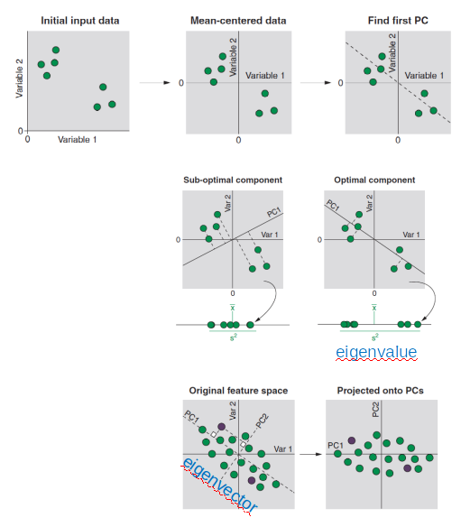
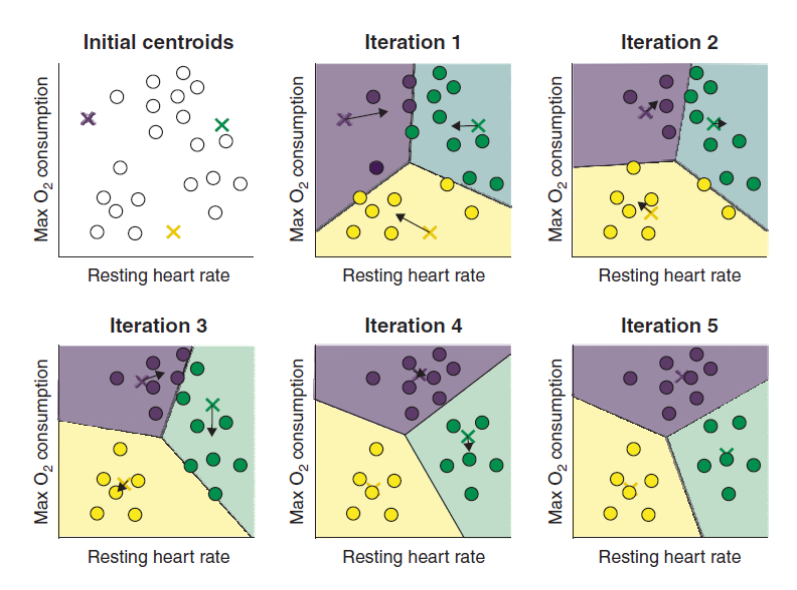
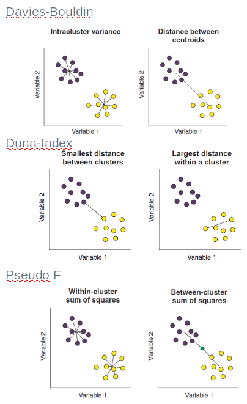
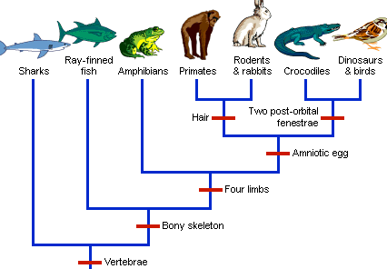

```{r setup, include=FALSE}
knitr::opts_chunk$set(echo = TRUE)
```

```{r, message=F}
library(tidyverse) # für Tabellenbearbeitung und ggplot2
library(ggpubr) # hilfreiche Erweiterung der Plots
library(factoextra) #plot PCA
library(GGally) #Gruppenplots
library(ggpubr) #eine Bibliothek für publikationsreife Graphen
```

# Lernen ohne Vorwissen (Unsupervised Machine learning)

Eine häufige Fragestellung, die man bei der Datenanalyse zu beantworten sucht, ist die Frage nach Ähnlichkeiten von Datensätzen, deren "wahre" Klassenzuweisung man nicht kennt. So lassen sich unvoreingenommen Zusammenhänge erkennen und Gruppierungen finden, die sonst dem menschlichen Urteilsvermögen überlassen wären. Diese Fragestellung lässt sich mit Clustering-Methoden angehen. Wir lernen jedoch zunächst die PCA kennen, die strenggenommen keine Clusteringmethode ist, dafür aber wertvolle Interpretationsansätze liefert und vom Menschen leicht nachvollzogen werden kann.

##    1. Principal Component Analysis (PCA)

In erster Linie ist die PCA eine Methode, um den mehrdimensionalen Raum der Parameter zu reduzieren und die "wichtigsten" darin zu identifizieren. Die Messwerte der Parameter werden auf einen niederdimensionalen Raum projiziert, wobei die relative Lage der Datenpunkte erhalten bleibt. Dabei generiert die PCA neue Variablen aus vorhandenen, die die Varianz in den Daten maximieren. Eine PC ist eine Linearkombination der betrachteten Attribute PC1 = αVar1 + βVar2, so, dass die Varianz(PC1) maximal ist und die Loadings α^2 + β^2 = 1.



Hat man die erste PC gefunden, wird die nächste PC senkrecht zu der ersten aufgebaut (Theoretisch ist die Anzahl der Komponenten = min(NAttribute ; NData- 1)). Daraus folgt, dass die erste PC die meiste Datenvarianz erklärt, die weiteren immer weniger. Man reduziert die Anzahl der Variablen, indem man nur die PCs weiter betrachtet, die den Großteil der Varianz erklären. Nebenbemerkung: Die Varianz der Daten entlang einer PC nennt man Eigenwert (eigenvalue)

Wir betrachten als Beispiel den Iris Datensatz. Dabei ändern wir zu Demonstrationszwecken die Einheit einer Messvariablen von cm in mm
```{r}
iris$Sepal.Length <- iris$Sepal.Length * 10 #Ändern von cm in mm für Demozewck! 
ggpairs(iris, mapping = aes(col=Species))
```

Das ist noch übersichtlich genug, aber viel mehr Variablen wird der Analyst nicht gut verarbeiten/darstellen können.

```{r, fig.width=12}
#PCA
pca_unnorm <- prcomp(iris[ , !names(iris) %in% c("Species")] ,center = F,scale. = F) 
#Samples plot
sam <- fviz_pca_ind(pca_unnorm, label="none", habillage=iris$Species,addEllipses=TRUE, ellipse.level=0.95, title=paste("PCA"))
#Loadings plot
loading <- fviz_pca_var(pca_unnorm, select.var = list(contrib = 15), col.var="contrib", repel=T, axes=c(1,2))+scale_color_gradient2(low="blue", mid="white",high="red")+theme_bw()
# Biplot Proben + Variablen
biplot <- fviz_pca_biplot(pca_unnorm, repel = TRUE, label = "var", # hide individual labels
             habillage = iris$Species,
             palette = c("#00AFBB", "#E7B800", "#FC4E07"),
             addEllipses = TRUE )
#Beitrag der Variablen zu PC1
beitrag <- fviz_contrib(pca_unnorm, choice = "var", axes = 1)
#Erklärte Varianz durch die einzelnen Komponenten
var_explained <- fviz_eig(pca_unnorm, addlabels=TRUE, hjust = -0.3)

figure <- ggarrange(var_explained, sam,biplot,beitrag,
                    ncol = 2, nrow=2)
figure
```

Hieran sieht man, dass die Variable mit der größten Varianz (Sepal.Length) den größten Beitrag zur PCA geliefert hat. Dies ist allerdings so nicht gewollt. Deswegen wiederholen wir dei PCA, wobei wir diesmal die Daten vorher skalieren.
```{r}
#PCA
pca_norm <- prcomp(iris[ , !names(iris) %in% c("Species")] ,center = T,scale. = T) 
#Samples plot
sam <- fviz_pca_ind(pca_norm, label="none", habillage=iris$Species,addEllipses=TRUE, ellipse.level=0.95, title=paste("PCA"))
#Loadings plot
loading <- fviz_pca_var(pca_norm, select.var = list(contrib = 15), col.var="contrib", repel=T, axes=c(1,2))+scale_color_gradient2(low="blue", mid="white",high="red")+theme_bw()
# Biplot Proben + Variablen
biplot <- fviz_pca_biplot(pca_norm, repel = TRUE, label = "var", # hide individual labels
             habillage = iris$Species,
             palette = c("#00AFBB", "#E7B800", "#FC4E07"),
             addEllipses = TRUE )

#Beitrag der Variablen zu PC1
beitrag <- fviz_contrib(pca_norm, choice = "var", axes = 1)
#Erklärte Varianz durch die einzelnen Komponenten
var_explained <- fviz_eig(pca_norm, addlabels=TRUE)
#fviz_screeplot(pca_norm, addlabels=TRUE, choice="variance")

figure <- ggarrange(var_explained, sam,biplot,beitrag,
                    ncol = 2, nrow=2)
figure
```


Das sieht schon besser aus. Die erste Komponente erklärt die Datenvarianz hauptsächlich durch die Variablen Petal.Length, Petal.Width, Sepal.Length. Aus dem Biplot erkennt man auch, dass Setosa in diesen Parametern kleinere Werte hat, jedoch leicht erhöhte Sepal.Width (Pfeilrichtung kombiniert mit Gruppenaufspaltung in PCA Plot). Im Screeplot sieht man, welchen Anteil der Varianz welche Hauptkomponente erklärt. Zur Dimensionsreduktion könnte man sich hier auf die beiden ersten Komponenten konzentrieren, da PC3 und erst recht PC4 verglichen mit PC1, PC2 einen weitaus geringeren Beitrag liefern und vernachlässigt werden können. Der PCA-Plot zeigt, dass es eine deutliche Aufspaltung von Iris setosa von den anderen beiden Irisarten gibt, während I. versicolor und I. virginica einander in den gewählten Parametern ähneln, womit wir den Bogen zur Clusteranalyse schlagen. Bemerkenswert daran ist, dass wir die Gruppen auftrennen können, OHNE vorher Attribute ausgewählt zu haben, die die Auftrennung vollziehen sollen, dies geschah "automatisch". Anschließend können Sie sich auf die interessanten Features konzentrieren.  
Man kann sich die Daten für jeden einzelnen Datenpunkt und die Loadings auch in Tabellenform extrahieren:
```{r}
myscores <- pca_norm$x #scores der einzelnen Datenpunkte
head(myscores)
myloadings <- pca_norm$rotation #loadings der Attribute
head(myloadings)
```

Innerhalb der PC2 haben die Sepalenlänge und -breite einen viel größeren Einfluss, weshalb man sich (für PC2) auf diese beiden Attribute fokussieren würde. 
Über die Funktion summary() kann man die wichtigen PCA-Parameter in Tabellenform betrachten:
```{r}
summary(pca_norm)
```

Die SD ist die Wurzel der Varianz entlang der jeweiligen Komponente (=eigenvalue). Teilt man jeden *eigenvalue* durch die Summe der *eigenvalues*, erhält man den jeweiligen Anteil der Komponente an der Varianz.

##    2. Clustering (k-Means, HCA)

Das Ziel des Clusterings ist es, Gruppen von Datensätzen zu finden, die zueinander ähnlicher sind, als zu Mitgliedern anderer Gruppen. Dabei braucht man **keine Klassenkenntnis**, um Muster zu erkennen (unsupervised learning). Es gibt diverse Clusteringmethoden, z.B.:

+ „visuelles“ Clustering mit PCA, t-SNE
+ Sphärisches Clustering (k-Means)
+ Hierarchisches Clustering (HCA)
+ Dichtebasiertes Clustering (DBSCAN, OPTICS)

### k-Means

Der k-Means Clusteringalgorithmus beinhaltet ff. Schritte:

+ Setze k-Zentren zufällig in den Datenraum. Die Anzahl der Zentren (entspricht der Anzahl der erwarteten Cluster) muss man als Nutzer vorgeben!
+ Miss Abstand von jedem Datenpunkt zu jedem Zentroid
+ Weise die Klasse des dem Datenpunkt nächsten Zentroids zu
+ Berechne Mittelpunkt (mean) des entstandenen Clusters => neuer Zentroid
+ Wiederhole ab 2, bis sich die Zentroiden nicht verändern



Da die initiale Zentroidauswahl bei kMeans zufällig erfolgt und somit einen Einflus auf das Ergebnis haben kann, müssen wir zunächst einen reproduzierbaren Zufallswert setzen. Wir führen kMeans auf dem Originaldatensatz aus. Alternativ könnten wir es kMeans erleichtern und zunächst mittels PCA die Anzahl der Dimensionen reduzieren und kMeans auf den Hauptkomponenten der PCA berechnen. Da der Irisdatenssatz ohnehin nur 4 Parameter enthält, verzichten wir hier darauf.
```{r}
set.seed(123)
km3 <- kmeans(iris[,1:4],
              centers = 3, # Anzahl der Zentroiden
              nstart=10, # Wie oft werden die Zentroiden zufällig gesetzt
              iter.max = 10 # Wie oft iteriert der Algorithmus durch die Daten (Neuberechnung der Zentroiden)
              )
#um dies darzustellen, holen wir die bestimmte Klassenzugehörigkeit und färben den Plot danach.
iris$kmeans_cluster <- as.character(km3$cluster)

#plot
ggplot(iris, aes(Sepal.Length, Sepal.Width))+
  geom_point(aes(shape = Species, color=kmeans_cluster, size=4))+
  ggtitle("Gruppierung des Iris-Datensatzes nach kMeans Clustering\nund die echten Klassen")

```
Um zu ermitteln, wie gut das Clustering funktioniert hat und wie gut die einzelnen Cluster von ihren Nachbarn abgetrennt wurden, kann man verschiedene Kriterien zu Rate ziehen:

+ Davies-Bouldin Index: Verhältnis von Itracluster Varianz zu Zentroidabstand (je kleiner, desto besser) 
+ Dunn Index: Verhältnis minimaler Abstand zwischen Clustern zu größten Intraclusterabstand (je größer, desto besser) 
+ Pseudo F: Verhältnis Sum-of-Squares innerhalb des Clusters zu Sum-of-Squares zwischen Clustern (je größer, desto besser)



```{r, fig.width=8}
#Berechnen der Clusteringqualität
library("clusterSim")

DaviesBouldinInd <- index.DB(iris[,1:4], km3$cluster, d=NULL, centrotypes="centroids", p=2, q=2)
DaviesBouldinInd$DB
# Je kleiner der Wert (zwischen 0 und Inf) , desto besser ist die Klassentrennung erfolgt 

# Bestimme optimale Clusteranzahl
totWithSS <- c()
DaviesBouldinInds <- c()
pseudoF <- c()
for (i in 2:10){
  print(i)
  set.seed(123)
  kmeans_cluster <- kmeans(iris[,1:4],centers = i,nstart=10,iter.max = 10)
  totWithSS <- c(totWithSS,kmeans_cluster$tot.withinss)
  DaviesBouldinInd <- index.DB(iris[,1:4], kmeans_cluster$cluster, d=NULL, centrotypes="centroids", p=2, q=2)
  DaviesBouldinInds <- c(DaviesBouldinInds,DaviesBouldinInd$DB)
  pseudoF <- c(pseudoF,index.G1(iris[,1:4], kmeans_cluster$cluster,d=NULL,centrotypes="centroids"))
  
}
kmeans_optClusteriris <- data.frame(cluster = seq(2,10),totWithSS=totWithSS,DaviesBouldinInds=DaviesBouldinInds, pseudoF=pseudoF)
wSS <- ggplot(kmeans_optClusteriris, aes(x=cluster, y= totWithSS))+labs(title="Total within Sum of Squares",subtitle="Optimales k am 'Ellbogen'")+geom_line()
db <- ggplot(kmeans_optClusteriris, aes(x=cluster, y= DaviesBouldinInds))+labs(title="Davies-Bouldin",subtitle="Optimales k am Minimum") + ylab("Davies-Bouldin Index")+geom_line()
pF <- ggplot(kmeans_optClusteriris, aes(x=cluster, y= pseudoF))+labs(title="Pseudo F",subtitle="Optimales k am Maximum") + ylab("Pseudo F Index")+geom_line()
figure <- ggarrange(wSS,db,pF,ncol = 3)
figure

```

Wieviele Cluster würden Sie anhand dieser Ergebnisse wählen?

**Verständnisfrage:** Warum findet k-Means sphärische Cluster? 

### Hierarchisches Clustering (HCA)

Liegt den Daten eine andere (nicht-sphärische) Struktur zugrunde, muss man auf andere Methoden ausweichen. 

Printipiell sind sie mit Hierarchischem Clustering bereits vertraut, da ein klassisches Beispiel der Abstammungsbaum darstellt:


Die HCA berechnet eine Hierarchie von Clustern innerhalb von Clustern. Dabei kann sie bottom-up oder top-down vorgehen: 

+ Agglomeratives Clustering: Vereinigung von ähnlichen Datenpunkten/Clustern zu Clustern höherer Ordnung 
+ Divisives Clustering: trenne Daten rekursiv in immer kleinere Cluster


```{r}
hccomplete <- hclust(dist(iris[,1:4]), method ="complete") #dist berechnet die Distanzmatrix zwischen den einzelnen Punkten
#standard plot
plot(hccomplete,hang = -0.1, cex = 0.3,
     main = "Cluster dendrogram",  
     xlab = "Irisse", ylab = "Height")
```

Das sieht noch nicht wirklich so aus, als dass man leicht etwas erkennen würde. Deswegen behelfen wir uns mit einer weiteren Zeichenbibliothek.
```{r, fig.width=12}
library(dendextend) #Zeichnet schöne Dendrogramme
library(colorspace) #to translate factors to colors
library(plotrix) #to translate hex to color

# transformiere hclust Objekt in ein Dendrogramm
dend <- hccomplete %>% as.dendrogram
# Weise den Quartilen der jeweiligen Parameter Farben zu, um nach Quartilen zu unterscheiden.
the_bars <- cbind(sapply(cut(iris$Sepal.Length,breaks=c(0,unname(quantile(iris$Sepal.Length))), labels=heat_hcl(5)), color.id),
                  sapply(cut(iris$Sepal.Width,breaks=c(0,unname(quantile(iris$Sepal.Width))), labels=heat_hcl(5)), color.id),
                  sapply(cut(iris$Petal.Length,breaks=c(0,unname(quantile(iris$Petal.Length))), labels=heat_hcl(5)), color.id),
                  sapply(cut(iris$Petal.Width,breaks=c(0,unname(quantile(iris$Petal.Width))), labels=heat_hcl(5)), color.id))
#plot
par(mar = c(17,3,1,1))
dend %>% color_labels(dend, k = 3) %>% #add nodes
  set("labels_cex", 0.5) %>% # Change size
  plot(main = "Hierarchical cluster dendrogramm") # plot

colored_bars(colors = the_bars, dend = dend, rowLabels = c("Sepal.Length","Sepal.Width","Petal.Length","Petal.Width"), sort_by_labels_order = FALSE) #sort_by_labels_order = FALSE ist sehr wichtig, da ansonsten die Färbung anhand der Aufrittsreihgenfolge im Datensatz erfolgt und nicht nach der Position im Dendrogramm
```
```{r}
hc_cluster <- cutree(hccomplete, k=4)
plot(hccomplete,hang = -0.1, cex = 0.3,
     main = "Cluster dendrogram",  
     xlab = "Irisse", ylab = "Height")
rect.hclust(hccomplete, k=4)
```

Jetzt können wir noch unseren Datensatz bezüglich der Clusterzuweisung betrachten. Diesmal machen wir es über alle Parameter.
```{r}
iris$hca_cluster <- as.character(hc_cluster)
ggpairs(iris[,c(1:4,7)], aes(col=hca_cluster),
        upper = list(continuous = "density"),
        lower = list(continuous = wrap("points", size=0.5)))
```

**Frage:** Wie beurteilen Sie das ergebnis der HCA?
