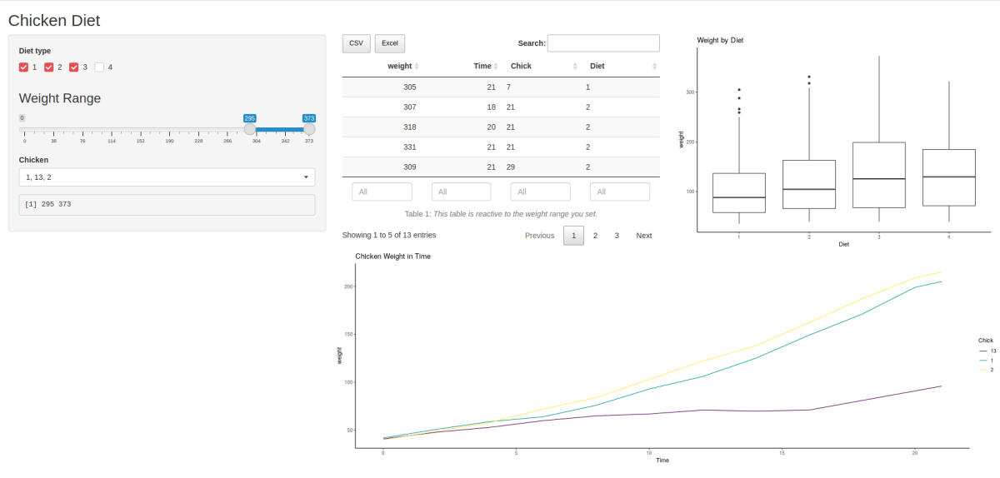

```{r setup, include=FALSE}
knitr::opts_chunk$set(echo = TRUE)
```

# Shiny Intro

Shiny bietet eine R-Infrastruktur, die das Erstellen von html-Webseiten mit Frontend und Backend ohne notwendigerweise Detailkenntnisse von HTML/CSS/JavaScript zu haben. Sie können [hier](https://shiny.rstudio.com/gallery/) ein paar Anregungen finden. Die Möglichkeiten sind fast unbegrenzt und Sie können die gesamte Analysepower von R im Hintergrund nutzen. Eine sehr gute und detaillierte Anleitung finden Sie [hier](https://mastering-shiny.org/).

## Statische html-App
Wir bauen zunächst eine super-simple Anwendung. Dabei würde man eine Shiny-App nicht in RMarkdown entwickeln, weshalb Sie die Codesegmente am besten in eine neue Datei kopieren, die app.R heißen muss. Alternativ können Sie die UI und das Backend (server) in zwei Files aufteilen, die ui.R bzw server.R heißen:

Code für "Hello world" App:
```{r}
#übertragen Sie den Code in das File app.R:
library(shiny)
ui <- fluidPage(
  "Hello, my world!"
)
server <- function(input, output, session) {
}
shinyApp(ui, server)
```

Alternative mit zwei Files:
```{r}
# Code für ui.R:
library(shiny)
ui <- fluidPage(
  "Hello, world!"
)
# Code für server.R
library(shiny)
server <- function(input, output, session) {
}

# shinyApp(ui, server)
```

Wenn Sie app.R bzw ui.R+server.R erstellt haben, werden Sie in RStudio einen grünen Pfeil "Run App" bemerken. Damit kann man die App starten. Wenn Sie "Run App" aufklappen, können Sie noch "run external" auswählen. Starten Sie die App jetzt, öffnet sich ihr Default-Browser, in dem die App läuft. Herzlichen Glückwunsch, Sie haben ihre Web-App gebaut, ohne eine Zeile html zu schreiben! 

## App mit Nutzerinteraktion

Allerdings hat die "Hello world" Seite noch keine PoweR und keine Interaktionsmöglichkeiten. Das holen wir jetzt nach. Wenn Sie sich jemals gefragt haben, welche Beispieldatensätze R in der Bibliothek "datasets" anbietet (ungeachtet all der Datensätze, die in Spezialpaketen geliefert werden), können Sie eine einfache Übersichtsapp dazu bauen: 
```{r}
#übertragen Sie den Code in das File app.R:
ui <- fluidPage(
  #hier will Shiny Input vom User
  selectInput("dataset", label = "Dataset", choices = ls("package:datasets")),
  #hier wird definiert, wo der im server.R (siehe dort output$summary, output$table) erzeugte Output erscheinen soll
  verbatimTextOutput("summary"),
  tableOutput("table"),
  plotOutput("plot")
)
server <- function(input, output, session) {
  # reactive: reagiert auf Änderungen des Inputs, hier: input$dataset
  dataset <- reactive({
    get(input$dataset, "package:datasets")
  })

  output$summary <- renderPrint({
    # Use a reactive expression by calling it like a function
    summary(dataset())
  })

  output$table <- renderTable({
    dataset()
  })
  
  output$plot <- renderPlot({
      plot(dataset())
  }, res = 96)
}
shinyApp(ui, server)
```

In der App können Sie im Drop-down Selektor einen Datensatz auswählen, worauf eine Übersicht über den Datensatz erstellt wird.

**Aufgaben:** 

1. vollziehen Sie nach, wie die Summary und die Datensatztabelle generiert wurden.

2. Generieren Sie noch ein Summary-Element auf der Seite. Was müssen Sie beachten?

## UI Elemente

Wir haben bisher eine sehr grundlegende Art der UI kennengelernt. Dies wollen wir jetzt mit ein paar weiteren Elementen aufpeppen. [hier](https://shiny.rstudio.com/gallery/widget-gallery.html) und [hier](https://shinyapps.dreamrs.fr/shinyWidgets/) können Sie sich Anregungen holen.

**Aufgabe**: erstellen Sie mit dem ChickWeight Datensatz aus dem datasets-Paket eine etwas komplexere App, die dem Nutzer mehr Interaktionsmöglichkeiten bietet. Sie könnte z.B. so aussehen:


Zur Info: grundsätzlich gibt es ff. Arten des Outputs:
+ **UI**                --> **server**            --> **Ergibt**
+ dataTableOutput	  --> renderDataTable   --> DataTable
+ htmlOutput	                            --> raw HTML
+ imageOutput	      --> renderImage       --> image
+ plotOutput	      --> renderPlot        --> plot
+ tableOutput	      --> renderTable       --> table
+ textOutput	      --> renderText        --> text
+ uiOutput	        --> renderUI          --> raw HTML
+ verbatimTextOutput    --> renderPrint   --> text

```{r}
library(shiny)
library(shinyWidgets)
library(ggplot2)
library(dplyr)
ui <- fluidPage(
  titlePanel("Chicken Diet"),
  sidebarLayout(
    sidebarPanel(
    uiOutput("selectDiet")
  , uiOutput("selectWeight")
  , uiOutput("selectChick")
  , verbatimTextOutput("range")
    ),
    mainPanel(
      fluidRow(column(6, DT::dataTableOutput("table")),
               column(6, plotOutput("plotDiet")))
      ,
      fluidRow(plotOutput("plotChicken"))
    )
  )
)

server <- function(input, output, session) {
  #das ist unser Arbeitsdatensatz
  df <- datasets::ChickWeight

  #Auswahl der Diät
  output$selectDiet <- renderUI({
    awesomeCheckboxGroup(
   inputId = "Diet",
   label = "Diet type", 
    choices = unique(df$Diet),
   selected = unique(df$Diet)[1],
   inline = TRUE, 
    status = "danger"
)
  })
  
  #Auswahl des Vogels
  output$selectChick <- renderUI({
    pickerInput(
   inputId = "chicken",
   label = "Chicken", 
    choices = sort(unique(as.character(df$Chick))),
   multiple = TRUE
)
  })
  
  #Auswahl des Gewichts
  output$selectWeight <- renderUI({
    sliderInput("sliderWeight", label = h3("Weight Range"), min = 0, 
        max = max(df$weight), value = c(40, 60))
  })

  #Output des gewählten Gewichts
  output$range <- renderPrint({ input$sliderWeight })
  
  #Definiere Tabellenoutput
  output$table <- DT::renderDataTable({
    df %>% 
      filter(weight > input$sliderWeight[1])  %>% 
      filter(weight < input$sliderWeight[2])
  },   options = list(paging = TRUE,    ## paginate the output
                 pageLength = 5,  ## number of rows to output for each page
                 scrollX = TRUE,   ## enable scrolling on X axis
                 scrollY = TRUE,   ## enable scrolling on Y axis
                 server = TRUE,   ## use client-side processing
                 dom = 'Bfrtip',
                 buttons = c('csv', 'excel')
                 ),
    caption = htmltools::tags$caption(
    style = 'caption-side: bottom; text-align: center;',
    'Table 1: ', htmltools::em('This table is reactive to the weight range you set.')
  ), 
  extensions = 'Buttons',
  selection = 'single', ## enable selection of a single row
  filter = 'bottom',              ## include column filters at the bottom
  rownames = FALSE                ## don't show row numbers/names
  )
  
  # Definiere Boxplot fürs Gewicht
  output$plotDiet <- renderPlot({
      ggplot(df, aes(x= Diet, y=weight)) + 
      geom_boxplot() +
      ggtitle("Weight by Diet") + 
      theme_classic() 
  })
  
  # Definiere Gewichtzunahme in Zeit 
  output$plotChicken <- renderPlot({
    chickens <- input$chicken
    if(is.null(chickens)){
      chickens <- sort(unique(df$Chick))
    } 
  ggplot(df %>% filter(Diet %in% input$Diet) %>% filter(Chick %in% chickens), aes(x = Time, y = weight, color = Chick)) +
    geom_line() +
    ggtitle("Chicken Weight in Time") + 
    theme_classic() 
  })
}
shinyApp(ui, server)
```
```{r}

```

