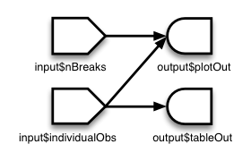

```{r setup, include=FALSE}
knitr::opts_chunk$set(echo = TRUE)
```

# Shiny Reaktivität

Der Kernvorteil und auch -anspruch an eine (Shiny-) App ist ihre Reaktivität, d.h. die Fähigkeit, auf sich ändernde Inputs zu reagieren und den Output dementsprechend zu generieren. In Shiny wird es erreicht, indem die input\$ -Elemente in sog. reaktive Funktionen eingebettet werden: entweder in die render*-Familie oder in reactive(). Diese Funktionen beobachten automatisch Veränderungen am input\$ und generieren den entsprechenden html-Output. Schauen wir uns den einfachsten Fall an:
```{r}
library(shiny)
ui <- fluidPage(
  textInput("name", "What's your name?"),
  textOutput("greeting")
)

server <- function(input, output, session) {
  output$greeting <- renderText({
    paste0("Hello ", input$name, "!")
  })
}
shinyApp(ui, server)
```



Die Abbildung verdeutlicht einen Aspekt der Reaktivität. Der Output, ein Plot und eine Tabelle, sind abhängig von den Inputs nBreaks und individualObs. Dabei wird Plot angepasst, sobald sich entweder nBreaks oder individualObs ändert. Die Tabelle wird angepasst, wenn es Änderungen an individualObs gibt. Dabei ist die Ausführung "faul", d.h. solange sich nichts am Input ändert, wird auch der Code des Outputs nicht ausgeführt. 

Es wird Situationen geben, in denen Sie den Input an verschiedenen Stellen des Codes brauchen. In diesem Fall ist es hilfreich, eine reactive() Funktion zu definieren, die bei Veränderungen des Inputs reagiert und das Ergebnis "zwischenspeichert". Wenn sie auf das Ergebnis zugreifen, wird nicht die Funktion ausgeführt, sondern das Ergebnis übergeben. Das wird v.a. bei zeitintensiven Funktionen interessant.

Der Reaktionsgraph dazu sieht so aus:

Der Output ist jetzt nicht mehr vom Input abhängig, sondern von der reactive() Funktion dazwischen. Das bedingt auch eine weitere Eigenschaft von Shiny: der Code einer Shiny-App wird nicht in der Reihenfolge ausgeführt, wie er aufgeschrieben wurde, sondern dann, wenn Shiny auf den jeweiligen output zugreifen möchte. D.h., Code, der in einem Output definiert wurde, der nicht angefragt wird, wird nie ausgeführt.

Schauen wir uns ein Beispiel zu reaktiven Elementen an:

```{r}
library(shiny)
ui <- fluidPage(
  textInput("name", "What's your name?"),
  textOutput("greeting"),
  verbatimTextOutput("greeting_copy"),
  actionButton("button", "Click me"),
  verbatimTextOutput("greeting_btn")
)

server <- function(input, output, session) {
  string <- reactive(paste0("Hello ", input$name, "!"))
  
  output$greeting <- renderText(string())
  
  output$greeting_copy <- renderPrint(string())
  
  #Reaktives Element, abhängig von Änderungen am Input
  observeEvent(input$name, {
    message("Greeting performed")
  })
  
  #reaktives Element, das erst bei Betätigung des Buttons generiert wird
  userName <- eventReactive(input$button, {
    string()
  })

  #output des 
  output$greeting_btn <- renderPrint({
    message("Greeting performed with Button")
    userName()
  })
}
shinyApp(ui, server)
```

