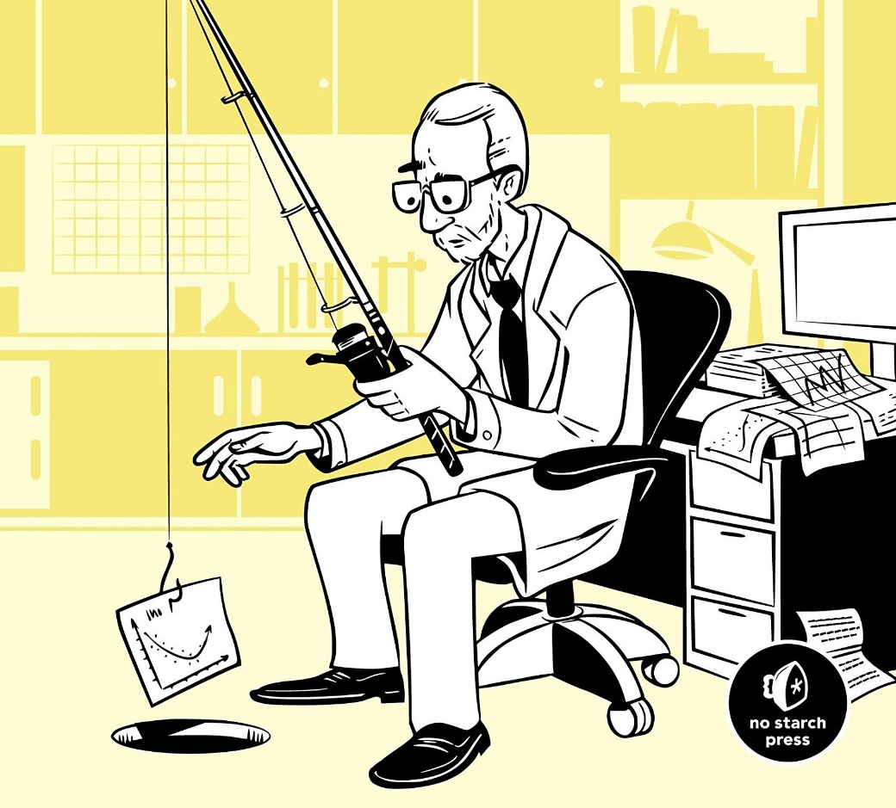

```{r setup, include=FALSE}
knitr::opts_chunk$set(echo = TRUE)
```

# App zur Verdienstvorhersage

Zuvor haben wir mit dem ChickenWeight Datensatz eine recht einfache Shiny-App gebaut, die es erlaubt, den Datensatz entsprechend darzustellen. Der Nutzer kann durch entsprechende Filter bestimmte Aspekte herausgreifen und sich die Ergebnisse ansehen. Dies wollen wir nun weiterführen und eine App bauen, die auch Vorhersagen liefern kann. Außerdem werden wir diesmal ein etwas komplexeres, moderneres Dashboard nutzen.

## Dashboards


Ein solches Dashboard lässt sich ganz einfach mittels dashboardPage() generieren. Dabei definiert man noch die Sidebar dashboardSidebar() und den Inhalt der Seite in dashboardBody():
```{r}
library(shinydashboard)
library(shiny)

ui <- dashboardPage(
  dashboardHeader(title = "Basic dashboard"),
  ## Sidebar content
  dashboardSidebar(
    sidebarMenu(
      menuItem("Dashboard", tabName = "dashboard", icon = icon("dashboard")),
      menuItem("Widgets", tabName = "widgets", icon = icon("th"))
    )
  ),
  
## Body content
  dashboardBody(
    tabItems(
      # First tab content
      tabItem(tabName = "dashboard",
        fluidRow(
          box(plotOutput("plot1", height = 250)),

          box(
            title = "Controls",
            sliderInput("slider", "Number of observations:", 1, 100, 50)
          )
        )
      ),

      # Second tab content
      tabItem(tabName = "widgets",
        h2("Widgets tab content")
      )
    )
  )
)

server <- function(input, output) {
  set.seed(122)
  histdata <- rnorm(500)

  output$plot1 <- renderPlot({
    data <- histdata[seq_len(input$slider)]
    hist(data)
  })
}

shinyApp(ui, server)
```
Jetzt werden wir das Modell, das wir mit dem Adult-Datensatz generiert haben, dafür benutzen, on-the-fly Vorhersagen für beliebige, vom Nutzer übergebene Daten vorherzusagen. 
MAchen Sie sich zunächst Gedanken dazu, wie solch eine Seite aussehen könnte und was sie dem Nutzer darstellen sollte. Gehen Sie dann dazu über, das Dashboard nach und nach zu definieren. 
Zunächst machen wir eine Seite mit einer kleinen Übersicht über den Datensatz.
```{r}
library(shinydashboard)
library(shiny)
library(ggplot2)
library(shinyWidgets)

#helper Functions
retrieve_adult <- function(){
    # Datensatz
  adult.data <- read.table("data/adult.data", sep=",")
  adult.test <- read.table("data/adult.test", sep=",")
  adult <- rbind(adult.data, adult.test)
  colnms <- c("age", 
  "workclass", 
  "fnlwgt",
  "education",
  "education-num",
  "marital-status",
  "occupation",
  "relationship",
  "race",
  "sex",
  "capital-gain",
  "capital-loss",
  "hours-per-week",
  "native-country",
  "class")
  colnms <- make.names(colnms)
  colnames(adult) <- colnms
  adult <- data.frame(lapply(adult, function(x) {
                    gsub("^[[:space:]]", "", x)}))
  adult[adult == "?"] <- NA
  adult$class <- gsub("[[:punct:]]$","", adult$class)
  numeric_cols <- c("age", "fnlwgt", "education.num" ,"capital.gain",   "capital.loss", "hours.per.week", "age_log")
  for (n in numeric_cols){
    cn <- which(colnames(adult)==n)
    adult[,cn] <-  as.numeric(adult[,cn])
  }
  return(adult)
}
ui <- dashboardPage(
  dashboardHeader(title = "Adult dashboard"),
  ## Sidebar content
  dashboardSidebar(
    sidebarMenu(
      menuItem("Datensatz", tabName = "datensatz", icon = icon("dashboard")),
      menuItem("Vorhersage", tabName = "vorhersage", icon = icon("th"))
    )
  ),
  
## Body content
  dashboardBody(
    tabItems(
      # First tab content
      tabItem(tabName = "datensatz",
        fluidRow(
          box(plotOutput("histogram", height = 250)),

          box(
            title = h3("Controls")
            , uiOutput("selectColumn.ui")
          )
        )
      ),

      # Second tab content
      tabItem(tabName = "vorhersage",
        h2("Verdienstvorhersage")
      )
    )
  )
)

server <- function(input, output) {
  adult <- retrieve_adult()
  #Auswahl des Spalte
  output$selectColumn.ui <- renderUI({
      numeric_cols <- c("age", "fnlwgt", "education.num" ,"capital.gain",   "capital.loss", "hours.per.week", "age_log")
       selectInput("selectColumn", h3("Select parameter"), 
             choices = numeric_cols, selected = numeric_cols[1])
  })
  output$histogram <- renderPlot({
    if (is.null(input$selectColumn)) {
        mycol = which(colnames(adult)=="age")
    } else {
        mycol = which(colnames(adult)==input$selectColumn)
      }
    ggplot(adult, aes(x= adult[,mycol])) +
      geom_histogram() +
      ggtitle(paste0("Histogram von ", input$selectColumn)) + 
      theme_classic() 
  })
}

shinyApp(ui, server)
```
Das Dashboard können Sie noch nach Beleben und Zeit ausschmücken. Wir machen jetzt die Seite für die Vorhersage.
```{r}
library(shinydashboard)
library(shiny)
library(ggplot2)
library(shinyWidgets)
library(caret)

#helper Functions
retrieve_adult <- function(){
  # Datensatz
  adult.data <- read.table("data/adult.data", sep=",")
  adult.test <- read.table("data/adult.test", sep=",")
  adult <- rbind(adult.data, adult.test)
  colnms <- c("age", 
              "workclass", 
              "fnlwgt",
              "education",
              "education-num",
              "marital-status",
              "occupation",
              "relationship",
              "race",
              "sex",
              "capital-gain",
              "capital-loss",
              "hours-per-week",
              "native-country",
              "class")
  colnms <- make.names(colnms)
  colnames(adult) <- colnms
  adult <- data.frame(lapply(adult, function(x) {
    gsub("^[[:space:]]", "", x)}))
  adult[adult == "?"] <- NA
  adult$class <- gsub("[[:punct:]]$","", adult$class)
  numeric_cols <- c("age", "fnlwgt", "education.num" ,"capital.gain",   "capital.loss", "hours.per.week", "age_log")
  for (n in numeric_cols){
    cn <- which(colnames(adult)==n)
    adult[,cn] <-  as.numeric(adult[,cn])
  }
  return(adult)
}

hot_one_adult <- function(mydf){
  mydf$capital.gain <- ifelse(mydf$capital.gain > 0, 1, 0)
  mydf$capital.loss <- ifelse(mydf$capital.loss > 0, 1, 0)
  numeric_cols <- c("age", "fnlwgt", "education.num" ,"capital.gain",   "capital.loss", "hours.per.week")
  cat_col <- setdiff(colnames(mydf), c("class",numeric_cols ))
  dummy <- dummyVars(" ~ .", data=mydf[,cat_col], fullRank = TRUE)
  newdata <- data.frame(predict(dummy, newdata = mydf)) 
  mydf <- cbind(mydf[,c("class",numeric_cols )], newdata)
  mydf$class <- ifelse(mydf$class ==">50K", "over50K","less50K")
  mydf$age_log <- log(mydf$age)
  nzv <- nearZeroVar(mydf)
  df <- mydf[, -nzv]
  return(df)
}
ui <- dashboardPage(
  dashboardHeader(title = "Adult dashboard"),
  ## Sidebar content
  dashboardSidebar(
    sidebarMenu(
      menuItem("Datensatz", tabName = "datensatz", icon = icon("dashboard")),
      menuItem("Vorhersage", tabName = "vorhersage", icon = icon("th"))
    )
  ),
  
  ## Body content
  dashboardBody(
    tabItems(
      # First tab content
      tabItem(tabName = "datensatz",
              fluidRow(
                box(plotOutput("histogram", height = 250)),
                
                box(
                  title = h3("Controls")
                  , uiOutput("selectColumn.ui")
                )
              )
      ),
      
      # Second tab content
      tabItem(tabName = "vorhersage",
              fluidRow(
                column(6 
                       , h2("Inputelemente")
                       , sliderInput("age", "Your age", min = 18, max = 100, value = 25)
                       , numericInput("workinghrs", "Working hours", value = 40)  
                       , checkboxInput("sex", strong("Are you male?"), value = TRUE)
                       , checkboxInput("race", strong("Are you white?"), value = TRUE)
                       , checkboxInput("marital", strong("Are you merried?"), value = TRUE)
                       , checkboxInput("children", strong("Do you have children?"), value = TRUE)
                       , radioButtons("workclass", "Workclass",
                                      choices = list("Government" = 1, "Private" = 2,"Self-employed" = 3),selected = 2)
                       , radioButtons("education", "Workclass",
                                      choices = list("Bachelors" = 1, "HS.grad" = 2,"Masters" = 3, "Some.college" = 4),selected = 1)
                       , radioButtons("occupation", "Occupation",
                                      choices = list("Craft.repair" = 1, "Exec.managerial" = 2,"Machine.op.inspct" = 3, "Other.service" = 4, "Prof.specialty" = 5, "Sales" = 6, "Transport.moving" = 7),selected = 6)
                       , checkboxInput("us", strong("Are you US native?"), value = TRUE)),
                column(6
                       , h2("Verdienstvorhersage", style="color:red")
                       , verbatimTextOutput("prediction"))
              )
              
      )
    )
  )
)

server <- function(input, output) {
  adult <- retrieve_adult()
  #Auswahl des Spalte
  output$selectColumn.ui <- renderUI({
    numeric_cols <- c("age", "fnlwgt", "education.num" ,"capital.gain",   "capital.loss", "hours.per.week")
    selectInput("selectColumn", h3("Select parameter"), 
                choices = numeric_cols, selected = numeric_cols[1])
  })
  output$histogram <- renderPlot({
    if (is.null(input$selectColumn)) {
      mycol = which(colnames(adult)=="age")
    } else {
      mycol = which(colnames(adult)==input$selectColumn)
    }
    ggplot(adult, aes(x= adult[,mycol], fill=class)) +
      geom_histogram() +
      ggtitle(paste0("Histogram von ", input$selectColumn)) + 
      theme_classic() 
  })
  
  #Elemente für das Vorhersagetab
  adult_ho <- hot_one_adult(adult)
  preProcValues <- preProcess(adult_ho, method = c("center", "scale"))
  model_knn <- readRDS(paste0(getwd(), "/data/model_knn.rds"))
  
  # Input des users
  test_user_df <- reactive({
    data.frame("fnlwgt"=median(adult_ho$fnlwgt, na.rm=T),
               "education.num"=median(adult_ho$education.num, na.rm=T), 
               "capital.gain"=0,#median(adult_ho$capital.gain, na.rm=T),
               "hours.per.week"=input$workinghrs,                   
               "age"=input$age,      
               "workclassLocal.gov"=if (input$workclass == 1) 1 else 0,
               "workclassPrivate"=if (input$workclass == 2) 1 else 0,
               "workclassSelf.emp.not.inc"=if (input$workclass == 3) 1 else 0,
               "educationBachelors"=if (input$education == 1) 1 else 0,
               "educationHS.grad"=if (input$education == 2) 1 else 0,
               "educationMasters"=if (input$education == 3) 1 else 0,
               "educationSome.college"=if (input$education == 4) 1 else 0,
               "marital.statusMarried.civ.spouse"=if (input$marital) 1 else 0,
               "marital.statusNever.married"=if (input$marital) 0 else 1,
               "occupationCraft.repair"=if (input$occupation == 1) 1 else 0,
               "occupationExec.managerial"=if (input$occupation == 2) 1 else 0,
               "occupationMachine.op.inspct"=if (input$occupation == 3) 1 else 0,
               "occupationOther.service"=if (input$occupation == 4) 1 else 0,
               "occupationProf.specialty"= if (input$occupation == 5) 1 else 0,
               "occupationSales"= if (input$occupation == 6) 1 else 0,
               "occupationTransport.moving"= if (input$occupation == 7) 1 else 0,
               "relationshipNot.in.family"= if (input$marital) 0 else 1, 
               "relationshipOwn.child"= if (input$children) 1 else 0,
               "relationshipUnmarried"= if (input$marital) 1 else 0,                           
               "raceBlack"= if (input$race) 0 else 1, 
               "raceWhite"= if (input$race) 1 else 0,
               "sexMale" = if (input$sex) 1 else 0,
               "native.countryUnited.States" = if (input$us) 1 else 0)
  })
  
  
  #Output des gewählten Verdienstes
  output$prediction <- renderPrint({ 
    test_user <- test_user_df()
    test_user$age_log <- log(test_user$age)
    test <- predict(preProcValues, test_user)
    prediction <- predict(model_knn, newdata = test)
    res <- if(prediction == "less50K" ) "<50K" else ">50K" 
    print(paste0("Ihr Verdienst ist ", res))
  })
}

shinyApp(ui, server)
```

## Wie geht es weiter?

Die Welt der Datenanalyse ist umfangreich, komplex, aber sehr dankbar. Die meisten Aufgaben verlangen ihnen nicht nur ein mathematisches Grundverständnis und eine penible Datenprüfung ab, sondern auch viel Kreativität bezüglich des Analysevorgehens und der Darstellung Ihrer Ergebnisse. Irgendwo verbirgt sich die besagte Nadel im Heuhaufen.

Es gibt im Internet sehr viele gute Quellen, von denen man sich dem Thema nähern kann. Die folgende Liste soll nur ein kleiner Primer sein:

+ [Einführung in Statistik](https://www.openintro.org/book/os/)
+ [Statistische Methoden](http://www.biostathandbook.com/)
+ [Machine Learning](https://www.manning.com/books/machine-learning-with-r-the-tidyverse-and-mlr)
+ [ML mit Caret](https://topepo.github.io/caret/)
+ [ML Projekte](https://www.mlyearning.org/)
+ [Shiny](https://mastering-shiny.org/)
+ [Styling](https://style.tidyverse.org/)
+ [Pakettierung](https://r-pkgs.org/)
